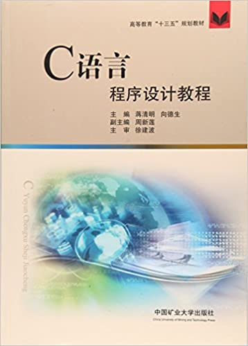

# C语言程序设计

## 目录
- 第一章 绪论
- 第二章 基本数据类型和运算发
- 第三章 控制结构
- 第四章 函数
- 第五章 数组
- 第六章 指针*
- 第七章 结构和共用**
- 第八章 文件**
- 第九章 程序设计实例**

[作业(附参考答案)]()

[综合实验]()
- 程序填空
- 程序改错
- 程序设计

**教材**：蒋清明, 向德生. C语言程序设计教程[M] (第二版). 中国矿业出版社, 2019. [PPT]()

